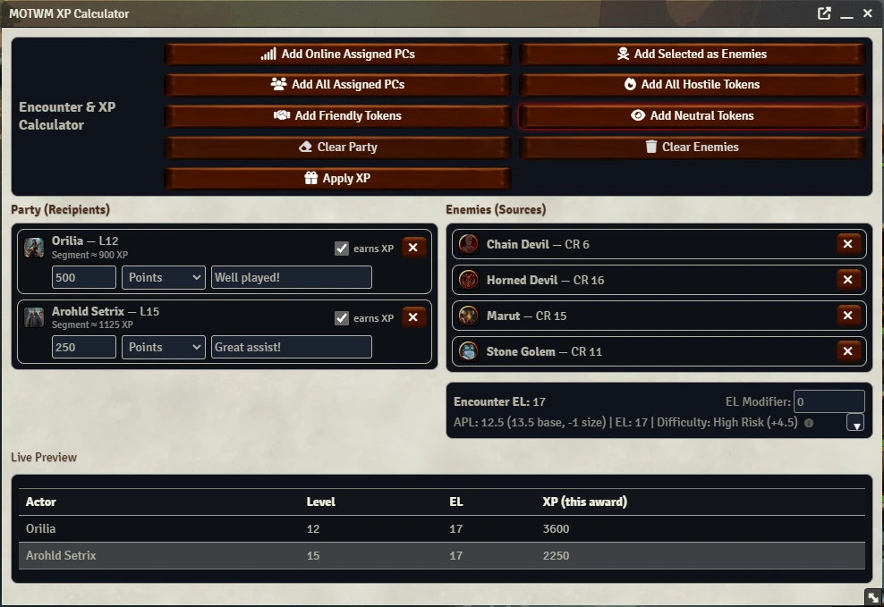

# Melody of the Weirding Mover — XP & Encounter Manager

**Version:** v1.0.2  
**For:** Foundry VTT v11 • D&D 3.5e (D35E ≥ 2.4.3)

A fast, GM-friendly encounter calculator and XP manager with a modern UI and a slick MMO-style player XP bar. Built for 3.5e RAW, with sensible features for real tables.

---

## Screenshots

### XP Calculator

### XP Bar

---

## Overview

This module gives GMs a live **Encounter Level (EL)** calculator, multiple **XP award modes**, manual bonus awards, and a one-click **rollback**. Players get a clean, draggable **XP bar** that shows progress (including banked levels).

---

## Key Features

### GM XP Calculator
- **3.5e RAW EL calculation** with an optional step-by-step **breakdown**.
- **Party-size adjustment** (baseline 4 PCs) so smaller/larger groups read correctly.
- **Live XP preview** per actor before you commit.
- **Two award modes:**  
  - **D&D 3.5e (Individual XP):** Official RAW method - awards XP per individual monster based on PC level vs monster CR, divided by party size.
  - **D&D 3.0 (split pot):** Uses a party pot based on APL vs. CR from the 3.0 DMG table, then splits among earners.
- **Manual awards** in **points** or **segments** ("bubbles"), with a reason that's posted to chat.
- **Encounter difficulty tag** (Easy / Even / Challenging / Very Challenging / High Risk).
- **Smart token tools:** add **online assigned PCs**, **all assigned PCs**, **friendly tokens** (scene), **selected to party**, **selected to enemies**, **all hostile tokens**, **all neutral tokens**.
- **Rollback** the last XP grant if you fat-finger something.

### Player XP Bar
- **MMO-style XP bar** at the bottom of the screen.
- **Layered progress** shows current level plus up to **3 banked levels** (different colors).
- **Classic 13⅓ segments** per level, for visual feedback on your progress.
- **Draggable & remembered** per client.

---

## Installation

1. Place the module in `Data/modules/` on your Foundry host.
2. Enable it in **World Settings → Manage Modules**.
3. Requirements: **Foundry v11** and **D35E ≥ 2.4.3**. (Other versions may work but aren’t yet tested.)

---

## How to Use

### GM
1. Click the **calculator icon** on the Token Controls toolbar.
2. Add party (e.g., **Add Online Assigned PCs**) and add enemies (e.g., **Add Selected as Enemies**).
3. Review the **Live XP preview** and **difficulty**.
4. Click **Apply XP** to award. If needed, use **Rollback** to remove the awards and chat messages (if used).

### Players
- The XP bar appears automatically (if allowed in settings).  
- Drag to reposition; the location is saved locally.  
- Layered colors indicate **banked levels** you haven’t “taken” yet.

---

## Advanced Details

### Encounter Level (EL) Calculation
The calculator follows the **Dungeon Master's Guide** logic for turning creature CRs into a single EL.

- **Identical creatures combine in doublings:** two of the same CR act as **EL +2**; four as **EL +4**; eight as **EL +6**, etc.
- **Mixed encounters**: groups are combined from highest CR downward; lesser creatures contribute less to the final EL.
- **Decimal CR support**: Fractional and decimal CRs (e.g., CR 7.5) are fully supported with linear interpolation for precise XP calculations.
- **Epic levels**: Full support for character levels 1-40 with proper XP progression.
- **Breakdown toggle**: show the exact steps used to reach the final EL (great for tuning and sanity checks).
- **Party-size adjustment**: EL is normalized to a 4-PC baseline, then adjusted up/down for your actual party count.

### Manual Awards
- Give **any amount** of XP in **points** or **segments** (“XP bubbles,” scaled to the recipient’s current level).
- Add a **reason** (e.g., “exceptional RP,” “smart tactics”), which appears in chat for clarity.

---

## Settings

- **Award Mode:**  
  - **D&D 3.5e (Individual XP)** - Default, official RAW method
  - **D&D 3.0 (split pot)** - Uses the old 3.0 style split pot method
- **Chat Broadcasting:** toggle XP award messages to the chat log.
- **Player Bar Visibility:** allow players to show/hide the XP bar.
- **XP Track:** the bar respects the D35E system's `experienceRate` (Fast/Medium/Slow) if your world uses it.

---

## Technical Notes

- **Tech:** TypeScript, Vite, Handlebars templates, modular CSS.
- **System Integration:** reads levels/XP from **D35E actor data**; XP bar thresholds follow the system’s track.

---

## Safety & UX

- Only **party-listed** actors receive XP. (You’ll see exactly who gets what.)
- **Rollback** lets you undo the last grant instantly.
- Separate chat messages for **encounter awards** and **manual awards**.
- Clear notifications when adding tokens (friendly/hostile/neutral/selected) to avoid surprises.

---

## Known Limitations / Notes

- **Party size adjustment** (shown in the encounter info) is for difficulty estimation only. The actual XP calculation uses the base APL without adjustment. Hover over the info icon for details.
- **Encounter CR/EL** math follows standard DMG logic; if you apply heavy homebrew CR adjustments, use the **EL Modifier** field.

---

## Changelog (v1.0.2)

- **3.5 XP Split** Corrected logic for 3.5 XP award party split.
- **XP bar** now shows/hides instantly when toggled (no reload required).
- **Decimal CR interpolation** for both award methods with epic level support (1-40).
- **Cleaner console** with debug logging removed (errors still logged).

See [CHANGELOG.md](CHANGELOG.md) for full version history.

---

## Credits

Created for **Melody of the Weirding Mover: Ahvindamahdorah’s Demise** By Xombit the Zombie.  
Thanks to the D35E system maintainers and the FoundryVTT community for APIs and examples.

